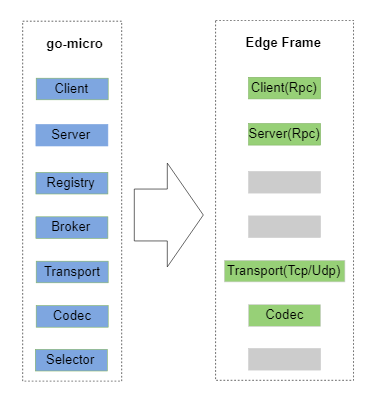

# x-edge

Edge framework for device connections modified from go-micro.
It supports raw tcp/udp and http in future.

## instruction

+ 当前项目还处于draft状态因为工作关系,变动可能会很大.

## Arch Spec

[说明文档](./docs/README.md)

## Struct



+ Edge部分实现中取消了go-micro中的Registry、Broker、Selector，保留了Client、Server、Transport和Codec

## Data Flow


+ 启动流程: go-micro启动----> x-edge 启动--->x-edge监听---> go-micro 监听
+ transport从device（client端）收到tcp或者udp数据包（数据包格式可以自定义，默认是xml），调用edge
+ edge通过Codec解码，并通过router，找到相应的handler
+ 在service的handler中，处理相应的业务message proc
+ 在message proc可以调用其他Service的broker或者rpc，将数据send出去。同时，也可以通过edgeClient回复数据包给device（client端）
+ 在私有数据包解码过程中，须要基于某个能识别的字段或者类型，定义数据包和hanler的映射关系,比如：`<evt>`数据包映射到名为`evthandle`的函数处理过程。

## Important

+ 当前项目还处于draft状态，变动可能会很大.
+ master分支，服务设计并不规范，但是可以用run.
+ dev-experiment 是做规范化micro接口风格的规范设计.

## principal concept

+ config better than code 配置优于代码
+ conversion better than config 约定优于配置
+ protocol data unit of each type mapping to a handler 每一个类协议数据包mapping 到一个具体handle
+ 约定协议数据包的分割方式

## How to Use

```bash
go get github.com/micro-community/x-edge

```
